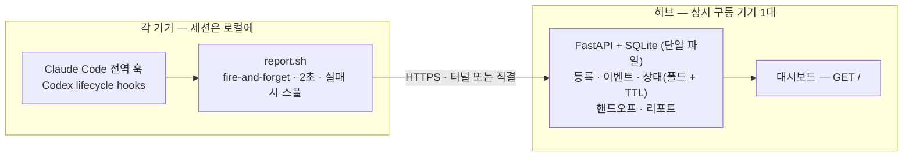

<p align="center">
  <picture>
    <source media="(prefers-color-scheme: dark)" srcset="assets/logo-dark.png">
    
  </picture>
</p>

<p align="center">
  <b>M</b>ulti-<b>A</b>gent &amp; <b>D</b>evice <b>I</b>ntegrated <b>S</b>upervision, <b>O</b>perations &amp; <b>N</b>etworking
</p>

<p align="center">
  <a href="LICENSE"></a>
  
  
</p>

<p align="center"><a href="README.md">English</a> · 한국어</p>

---

여러 기기에 흩어져 돌아가는 AI 코딩 에이전트 세션을 **한 화면에서** 관제하는 콘솔입니다.
Mac 여러 대(그리고 Windows)에서 **Claude Code**와 **Codex**를 함께 쓴다면, MADISON이
각 세션의 상태를 훅으로 모아 지금 어디서 무엇이 돌고 있는지, 무엇이 내 손을 기다리는지,
무엇이 조용히 멈췄는지를 대시보드 하나로 보여줍니다. 기기 사이로 작업을 옮기는 일도 합니다.
컨텍스트째로 **핸드오프**해 다른 기기에서 이어서 작업할 수 있습니다.

세션은 **전부 각자의 기기에서** 돌아가고, 허브로는 메타데이터와 짧은 발췌만 올라옵니다.
상태, 한 줄 요약에 쓰는 지시문 앞부분, 모델·effort(추론 강도), 시각 정도입니다. 코드와
파일은 기기를 떠나지 않습니다.

## 왜 필요한가

기기가 네다섯 대로 늘고 저마다 에이전트를 두어 개씩 돌리다 보면 금세 손을 놓칩니다.
어느 세션이 권한 승인을 기다리며 멈춰 있는지, 어느 것이 일을 끝내고 다음 지시를 기다리는지,
어느 것이 크래시로 세션만 덩그러니 남았는지 알 수가 없죠. MADISON은 플릿 전체에 대고
**"지금 내가 봐야 할 게 뭐지?"**에 답하고, 그 기기 앞까지 가지 않고도 한 기기의 작업을
다른 기기로 넘길 수 있게 해 줍니다.

## 기능

- **실시간 플릿 뷰** — 세션을 기기별로 묶고, 사람이 손대야 할 것(권한 승인, 완료 후
  입력 대기)이 맨 위로 오도록 정렬합니다.
- **믿을 수 있는 생사 판정** — 크래시·절전·네트워크 단절로 죽은 세션을, 발화를 장담할 수
  없는 종료 훅이 아니라 허브 쪽 TTL로 잡아냅니다.
- **작업 요약** — 각 세션의 지시를 허브의 작은 모델이 한 줄로 간추립니다. 기기에서 돌지도
  않고, 훅의 실행 경로에 끼어들지도 않습니다.
- **세션 추적** — 모든 세션의 id를 바로 볼 수 있고, 그 기기에서 `claude --resume <id>`
  또는 `codex resume <id>`로 이어서 열 수 있습니다.
- **핸드오프** — 작업 맥락(핸드오프 문서 + 변경 diff)을 허브가 직접 날라 커밋·push 없이
  다른 기기로 넘깁니다. 그 기기에 데스크탑 알림(macOS)이 뜨고 새 세션마다 안내가
  주입되며, Claude Code든 Codex든 원하는 쪽에서 `/pickup`으로 이어받습니다.
- **히스토리** — 기기·세션·핸드오프·이벤트 원장을 탭마다 필터링해 볼 수 있습니다.
- **일일/주간/월간 리포트** — 허브가 기간별 작업을 PM/오너 관점의 보고용 마크다운
  (서비스별 묶음·중첩 불릿)으로 정리해 노션에 붙여넣을 수 있습니다. 기간이 길수록
  나열 대신 더 포괄적으로 종합합니다. 주기 자동 갱신에 수동 갱신도 되고, 사용
  메트릭(턴·세션·활동 시간·프로젝트별/시간대 분포·52주 스트릭 잔디 — 좌우
  스크롤, 처음엔 최신 주가 보임)도 함께 보여줍니다.
- **허브 LLM 선택** — 설정 탭에서 태스크 요약과 리포트 생성 각각의 프로바이더
  (Claude Code/Codex)·모델·추론 강도를 고를 수 있고, 모델 목록은 허브에 설치된
  CLI에서 그대로 불러옵니다.
- **에이전트·실행 경로 구분** — `CLAUDE CODE` / `CLAUDE APP` / `CODEX CLI` / `CODEX APP`
  세션을 가려서 보여 주고, 자동화(cron·launchd의 headless 실행) 세션은 전용 탭으로 분리합니다.
- **로컬 우선, 메타데이터만** — 특정 벤더의 원격·클라우드 세션 인프라에 기대지 않습니다.
  허브는 온전히 당신 것입니다.

## 아키텍처



- **Collector**(기기마다): 전역 훅이 `report.sh`를 호출해 이벤트 메타데이터를 2초 타임아웃으로
  허브에 POST하고, 실패하면 디스크에 스풀해 둡니다. 세션을 절대 막거나 느리게 하지 않도록
  만들었습니다(무슨 일이 있어도 `exit 0`).
- **Hub**(한 대): FastAPI 프로세스 하나가 JSON API와 대시보드를 함께 서빙하고, 그 뒤를
  SQLite 파일 하나가 받칩니다. launchd로 상주시킵니다(스텁 동봉). Linux에선 systemd 등 아무 수퍼바이저나 쓰면 됩니다.
- **Dashboard**: `/api/state`를 5초마다 폴링하는, 그 자체로 완결된 HTML 페이지 하나입니다.

세션이 로컬에서 돌고 수집이 단방향이라(닿으면 좋고 안 닿아도 그만), 허브가 꺼져 있거나
재시작 중이어도 돌아가는 세션에는 **아무 영향이 없습니다.** 이벤트는 스풀에 쌓였다가 허브가
돌아오면 다시 보냅니다.

## 생사 판정은 이렇게

종료 훅은 믿을 수 없습니다(크래시·절전·강제 종료 때는 발화하지 않으니까요). 그래서 MADISON은
두 가지 신호를 씁니다. 도구를 쓸 때마다 훅이 스로틀된 하트비트를 보내 세션이 살아 일하고
있음을 알리고, 허브는 *작업 중*이던 세션이 15분간 조용하면 **끊김 의심(unconfirmed)**으로
표시합니다. 정당하게 쉬고 있는(사람을 기다리는) 세션은 타이머로 끌어내리지 않습니다.
진짜로 조용해진 *작업 중* 세션만 걸립니다.

## 에이전트 지원

| 경로 | 수집 |
|---|---|
| Claude Code — 터미널 CLI, 데스크톱 앱, IDE | **완전** — 프런트엔드 무관하게 동일한 전역 훅이 발화 |
| Codex — CLI/TUI, 데스크톱 | **완전** — 전역 lifecycle hooks로 세션·턴·도구·승인 이벤트 수집. 단, 호스팅 WebSearch처럼 로컬 훅 경로를 거치지 않는 일부 도구는 도구 단위 하트비트 제외 |
| 클라우드 채팅·웹 태스크 (claude.ai, ChatGPT, Codex web) | 범위 밖 — 훅을 걸 로컬 발자국이 없음 |

## 빠른 시작

**요구 사항:** Python 3.11+, `jq`, git. 허브는 macOS/Linux.

### 1. 허브 실행 (상시 구동 기기에서)

```bash
git clone https://github.com/hierrr/madison.git
cd madison
python3 -m venv .venv && .venv/bin/pip install -r requirements.txt
cp .env.example .env      # 편집: ENROLL_SECRET 설정, 터널로 노출할 거면 호스트명도
.venv/bin/python -m server
```

허브는 `127.0.0.1:8787`에서 대기합니다. 같은 기기에서는 <http://127.0.0.1:8787>로 엽니다.
다른 기기에서 접근하는 구성은 두 갈래입니다:

- **터널** (외부 접근): 허브를 터널 뒤에 둡니다 — 예: Cloudflare Tunnel. `.env`의
  호스트명과 `CF_ACCESS_*` 키가 이 구성용입니다. 사람용 대시보드 호스트는 SSO로
  보호하고, 기계용 API 호스트는 기기별 토큰으로 인증하는 식입니다. `.env.example`을
  참고하세요.
- **내부망 전용** (터널 없음): `HOST=0.0.0.0`으로 열고 터널 키는 비워둡니다. 수집기는
  기기 토큰을 들고 `http://<허브IP>:8787`로 직접 보고하고, 온보딩도
  `--hub http://<허브IP>:8787`로 하면 됩니다. 대시보드는 평범한 LAN 요청에는 닫혀
  있으니(401이 정상) 허브 기기에서 열거나, 다른 기기에서는 SSH 포트포워딩
  (`ssh -L 8787:127.0.0.1:8787 허브` 후 <http://127.0.0.1:8787>)으로 엽니다 — 허브에는
  루프백 연결로 보여 관리자가 됩니다. 평문 HTTP이므로 신뢰할 수 있는 망에서만 쓰고,
  필요하면 `IP_ALLOWLIST`로 기기 토큰을 IP에 추가로 묶을 수 있습니다.

어느 쪽이든 프로세스와 포트는 하나이며, 역할 구분은 경로가 아니라 요청에 실린
자격증명(기기 토큰 vs 관리자)으로 이뤄집니다.

상주 서비스로 돌리려면 `scripts/launchd/madison-hub` 스텁을 LaunchAgent 잡으로 등록하세요
(이 스텁이 `scripts/_launchd_wrapper.sh` → venv를 exec합니다. 스텁 파일명이 곧 로그인 항목의
표시 이름이 됩니다).

### 2. 기기 온보딩

제로터치입니다. 허브가 설치 스크립트를 직접 서빙하니, 각 기기에서 직접 실행하거나 그 기기의
에이전트에게 대신 실행해 달라고 맡기면 됩니다.

```bash
curl -fsSL https://madison-api.example.com/install.sh | bash -s -- \
  --name studio --secret <ENROLL_SECRET> --hub https://madison-api.example.com
# Claude Code + Codex 수집이 모두 기본 — Codex를 빼려면 --no-codex
```

이 명령은 기기를 등록하고(토큰은 서버에 해시로만 저장), Claude Code와 Codex의 전역 훅을
각자의 기존 훅과 병합하고 스풀 플러셔를 등록합니다. 과거 Madison의 Codex `notify`+60초
감시기가 설치돼 있으면 사용자 원래 `notify`를 복원한 뒤 구형 수집 경로를 제거합니다.
Codex에서는 설치 뒤 `/hooks`를 열어 새 command hooks를 검토·신뢰해야 합니다. 이미 열려 있던
Claude Code/Codex 세션은 다시 시작해야 새 훅이 적용됩니다. 기기를 전부 등록하고 나면
`ENROLL_SECRET`은 로테이트하세요.

### Windows (베타)

Windows 수집기는 launchd 대신 작업 스케줄러를 쓰는 PowerShell 스크립트
(`collector/install.ps1`, `report.ps1`)로 제공됩니다. 다만 **실기기에서 검증하지 않았고
macOS 수집기보다 기능이 뒤처지는** 베타입니다. 쓰는 방식은 똑같은 제로터치 온보딩이라, 그
기기의 에이전트에게 설치 명령을 건네고 훅 배선을 맡기면 됩니다. **WSL** 안에서 Claude Code를
쓴다면 리눅스용 `install.sh`를 그대로 쓰세요. 이쪽은 베타가 아니라 정식 지원 경로입니다.

## 기기 간 작업 이관

- **핸드오프**(사람이 이어받음): `/handoff <기기>`가 핸드오프 문서를 쓰고 미커밋 변경의
  diff(스태시·서브모듈 포함)를 떠서 허브 큐에 함께 올립니다 — 커밋·push가 필요 없습니다.
  미push 커밋 위의 작업, 상한 초과, 바이너리 변경만 `wip/` 브랜치 push로 폴백합니다.
  대상 기기에는 데스크탑 알림(macOS, 5분 폴링)이 가고, 그 리포의 새 세션마다 — Claude Code든
  Codex든 — 시작 시 안내가 주입됩니다. 자동으로 소비되는 것은 없습니다: 사용자가
  `/pickup`으로 착수를 승인할 때까지 *대기 중*으로 남고, 착수 시 diff를 적용(`git apply -3`)
  하며 *수신됨*, 작업이 끝나면 *완료*가 됩니다.


## 보안 모델

- **세션 전문은 기기 밖으로 나가지 않습니다.** 허브에는 메타데이터와 짧게 잘린 발췌만
  남습니다 — 지시문 앞 약 600자(요약용)와 응답·승인 메시지 200자입니다. 의도된 예외는
  핸드오프 하나입니다: `/handoff`는 사용자의 명시적 지시로 문서와 변경 diff를 허브에
  올립니다(64KB / 1MB 상한).
- **요청은 세 부류입니다.** 기기(bearer 토큰), 관리자(허브 기기의 루프백이거나 SSO로 검증된
  대시보드), 등록(공유 시크릿 — 로테이트가 전제). 루프백이라는 사실만으로 관리자로 믿지는
  않습니다. 터널 뒤에서 프록시된 인터넷 요청이 로컬인 척하지 못하도록 CF 헤더를 확인합니다.
- **상태를 바꾸는 엔드포인트에는 CSRF 방어**(`Sec-Fetch-Site`)를 걸어, 허브 기기에서 열려
  있는 아무 웹페이지가 디스패처를 건드리지 못하게 했습니다.
- **관리자(대시보드) 접근**은 허브 기기의 루프백 연결 — SSH 포트포워딩이 이 경로입니다 —
  과 검증된 Cloudflare Access JWT에 열려 있습니다. 허브 기기 위에 자체 인증 리버스
  프록시를 얹는 세 번째 경로도 됩니다 — 허브가 루프백을 신뢰하므로 로그인은 프록시가
  책임져야 합니다. API 쪽은 전송로와 무관하게 언제나 기기 토큰으로 인증합니다.

## 제거

전역 설정을 건드리는 도구라, 한 기기에서 되돌리는 방법입니다(macOS):

```bash
# 1. launchd 잡 중지
launchctl bootout "gui/$(id -u)/dev.madison.flush" 2>/dev/null
rm -f ~/Library/LaunchAgents/dev.madison.*.plist

# 2. 수집기·스킬 제거 (Claude Code·Codex 양쪽)
rm -rf ~/.claude/madison ~/.claude/skills/handoff ~/.claude/skills/pickup \
       ~/.codex/skills/handoff ~/.codex/skills/pickup

# 3. 훅 설정을 설치 시 만든 백업으로 복원
#    (settings.json.bak-madison-*, hooks.json.bak-madison-*, 구형 수집을 옮겼다면 config.toml 백업)
#    또는 ~/.claude/settings.json과 ~/.codex/hooks.json에서 MADISON 훅 항목을 직접 지웁니다.
```

마지막으로 대시보드 **기기** 탭에서 그 기기를 폐기해 토큰을 무효화하세요.

## 설정 (`.env`)

| 키 | 기본값 | 의미 |
|---|---|---|
| `HOST` / `PORT` | `127.0.0.1` / `8787` | 허브 바인드 주소 |
| `DB_PATH` | `data/madison.db` | SQLite 파일 |
| `ENROLL_SECRET` | — | 기기 등록용 공유 시크릿; 온보딩 후 비우거나 로테이트 |
| `DASHBOARD_HOST` / `API_HOST` | `madison.example.com` / `madison-api.example.com` | 터널 구성 전용 — 사람용/기계용 호스트명 (허브 코드는 `API_HOST`만 검사해 그 호스트를 `/api/*`·설치 경로로 제한) |
| `CF_ACCESS_TEAM_DOMAIN` / `CF_ACCESS_AUD` | — | 터널 구성 전용 — 대시보드용 Cloudflare Access JWT 검증. 내부망 전용이면 비워둠 |
| `TTL_STALE_MIN` | `15` | 작업 중 세션이 *끊김 의심*이 되기까지의 무신호 분 |
| `DEVICE_ONLINE_MIN` | `10` | 이 분 이내 신호가 있으면 기기를 온라인으로 |
| `ENDED_HIDE_HOURS` | `24` | 종료 세션이 현황에서 사라지기까지의 시간 |
| `EVENT_RETENTION_DAYS` | `0` | 이벤트 로그 보존 일수 — `0`이면 무기한 보존 |
| `TASK_SUMMARY` | `1` | 허브의 한 줄 요약 — 허브 기기에 선택한 프로바이더의 CLI 필요(없으면 원문 발췌로 대체) |
| `TASK_SUMMARY_MODEL` / `TASK_SUMMARY_BIN` | Haiku / `~/.local/bin/claude` | 요약 워커가 호출하는 모델·`claude` 바이너리 |
| `CODEX_BIN` | 자동 탐색 | 프로바이더를 Codex로 고를 때 쓰는 `codex` 바이너리 (PATH → 최신 nvm 설치본 순) |
| `REPORT` | `1` | 일일/주간/월간 업무 리포트 |
| `REPORT_MODEL` | `claude-sonnet-5` | 리포트 생성 모델 |
| `REPORT_DAILY_MIN` / `REPORT_WEEKLY_MIN` / `REPORT_MONTHLY_MIN` | `60` / `1440` / `1440` | 일일/주간/월간 리포트 자동 갱신 주기(분) |
| `REPORT_EXCLUDE_PROJECTS` | *(없음)* | 리포트에서 제외할 프로젝트(콤마 구분) — 해당 프로젝트 섹션과, 다른 프로젝트 로그에서 그 이름이 언급된 줄까지 뺀다 |
| `IP_ALLOWLIST` | *(off)* | 선택 — 기기 보고를 제한하는 `이름:ip` 목록 |

프로바이더·모델·추론 강도·CLI 경로 같은 LLM 관련 값은 대시보드 **설정** 탭에서도
바꿀 수 있습니다. 거기서 저장한 값은 허브에 보관되며 `.env` 기본값보다 우선합니다.

## 저장소 구조

| 경로 | 내용 |
|---|---|
| `server/` | 허브 — FastAPI + SQLite (등록·수신·상태 폴드·TTL·핸드오프 큐·리포트·요약 워커) |
| `dashboard/` | 단일 HTML 대시보드 + 로고 자산 |
| `collector/` | 기기 쪽 전부 — Claude/Codex 훅·`report.sh`·멱등 설치 스크립트·`/handoff`·`/pickup` 스킬·Windows 베타 |
| `scripts/` | launchd 스텁 (표준 패턴) |
| `tests/` | 허브 상태 폴드·수집기 회귀 테스트 |
| `assets/` | 프로젝트 로고 |

## 상태

개인용 플릿 콘솔로 만들어 실제로 쓰고 있습니다. Claude Code와 Codex의 로컬 CLI/앱 경로를
전역 훅으로 지원하며, Windows 수집기는 아직 베타(실기기 미검증)입니다. 기여는 언제든 환영합니다.

## 라이선스

[MIT](LICENSE) © hierrr
