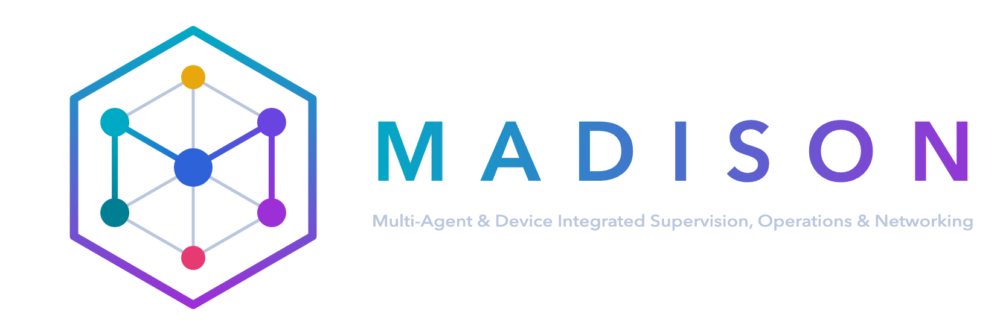
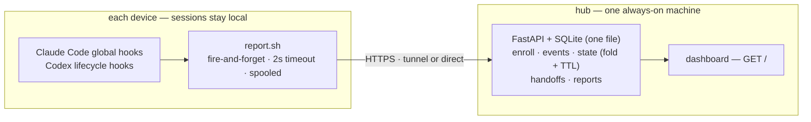

<p align="center">
  <picture>
    <source media="(prefers-color-scheme: dark)" srcset="assets/logo-dark.png">
    
  </picture>
</p>

<p align="center">
  <b>M</b>ulti-<b>A</b>gent &amp; <b>D</b>evice <b>I</b>ntegrated <b>S</b>upervision, <b>O</b>perations &amp; <b>N</b>etworking
</p>

<p align="center">
  <a href="LICENSE"></a>
  
  
</p>

<p align="center">English · <a href="README.ko.md">한국어</a></p>

---

A single-pane control console for AI coding-agent sessions spread across many
machines. If you run **Claude Code** and **Codex** on several Macs (and a
Windows box), MADISON collects each session's state through hooks and shows —
in one dashboard — what is running where, what is waiting on you, and what has
gone quiet. It also moves work between machines: hand a task off
with its context so you can continue it on another machine.

Sessions run **entirely on their own machines**. The hub receives only metadata and
short text snippets — status, an instruction excerpt used for the one-line summary,
model/effort, timestamps. Your code and files never leave the device.

## Why

Once you have four or five machines each running a couple of agents, you lose
track: which session is blocked on a permission prompt, which finished and is
waiting for your next instruction, which crashed and left a session dangling.
MADISON answers "what needs me right now?" across the whole fleet, and lets you
push a piece of work from one machine to another without walking over to it.

## Features

- **Live fleet view** — every session grouped by device, sorted so the things
  waiting on a human (permission prompts, idle-after-completion) float to the top.
- **Reliable liveness** — a session that crashes, sleeps, or drops its network is
  detected by a hub-side TTL, not just by an end-of-session hook that may never fire.
- **Task summaries** — each session's instruction is condensed to one line by a
  small model on the hub (never on the device, never in the hook's critical path).
- **Session traceability** — every session id is one click away and can be resumed
  on its machine with `claude --resume <id>` or `codex resume <id>`.
- **Handoff** — carry a task's context (handoff doc + change diffs, hub-carried,
  no commit or push) to another machine; the target gets a desktop notification and
  every new session there is briefed until you `/pickup` — in Claude Code or Codex,
  whichever you prefer.
- **History** — devices, sessions, handoffs, and the raw event log, each
  filterable, behind tabs.
- **Daily/weekly reports** — the hub condenses each period's work into a
  work-journal style markdown (grouped by service, nested bullets) you can paste
  into Notion, plus usage metrics (turns, sessions, active hours, a streak grid).
- **Agent + surface aware** — tells `CLAUDE CODE` / `CLAUDE APP` / `CODEX CLI` /
  `CODEX APP` sessions apart, and separates automated headless runs (cron/launchd)
  into their own tab.
- **Local-first & metadata-only** — no dependence on any vendor's remote/cloud
  session infrastructure; the hub is yours.

## Architecture



- **Collector** (per device): global hooks call `report.sh`, which POSTs event
  metadata to the hub with a 2-second timeout and spools to disk on failure. It is
  written to never block or slow a session (always `exit 0`).
- **Hub** (one machine): a single FastAPI process serves both the JSON API and the
  dashboard, backed by one SQLite file. Runs under launchd (stubs included), or any
  supervisor (systemd, etc.) on Linux.
- **Dashboard**: a single self-contained HTML page that polls `/api/state` every
  five seconds.

Because sessions are local and the collector is one-way and best-effort, the hub
can be down or restarting with **zero effect** on any running session — events
spool and resend when it returns.

## How liveness works

An end-of-session hook can't be trusted (crashes, sleep, killed terminals never
fire it). So MADISON uses two signals: tool-use hooks emit a throttled heartbeat
while a session works, and the hub marks a *working* session **unconfirmed**
after 15 minutes of silence. Sessions that are legitimately idle (waiting on you)
are never demoted by the timer — only genuinely silent *working* sessions are.

## Agent support

| Surface | Coverage |
|---|---|
| Claude Code — terminal CLI, desktop app, IDE | **Full** — the same global hooks fire regardless of front-end |
| Codex — CLI/TUI, desktop | **Full** — global lifecycle hooks collect session, turn, tool, and approval events. A few hosted tools such as WebSearch do not pass through local tool hooks and therefore do not emit per-tool heartbeats |
| Cloud chats / web tasks (claude.ai, ChatGPT, Codex web) | Out of scope — no local footprint to hook |

## Quick start

**Requirements:** Python 3.11+, `jq`, git. macOS/Linux for the hub.

### 1. Run the hub (on your always-on machine)

```bash
git clone https://github.com/hierrr/madison.git
cd madison
python3 -m venv .venv && .venv/bin/pip install -r requirements.txt
cp .env.example .env      # then edit: set ENROLL_SECRET, and hostnames if exposing via a tunnel
.venv/bin/python -m server
```

The hub listens on `127.0.0.1:8787`. On the same machine, open
<http://127.0.0.1:8787>. To reach it from other machines, put it behind a tunnel
(e.g. Cloudflare Tunnel) — a human dashboard host protected by your SSO, and a
machine API host authenticated by per-device tokens. See `.env.example`.

For a persistent service, register a LaunchAgent that runs `scripts/launchd/madison-hub`
(which execs `scripts/_launchd_wrapper.sh` → the venv). The stub's filename becomes the
login-item display name.

### 2. Onboard a device

Zero-touch: the hub serves its own installer. On each machine, run — or just ask
that machine's agent to run it for you:

```bash
curl -fsSL https://madison-api.example.com/install.sh | bash -s -- \
  --name studio --secret <ENROLL_SECRET> --hub https://madison-api.example.com
# Claude Code + Codex collection are both on by default; pass --no-codex to skip Codex
```

This registers the device (a long-lived token, hashed on the server), merges global
hooks for both Claude Code and Codex with any hooks already present, and schedules
the spool flusher. If an older Madison Codex `notify` + 60-second watcher install is
present, the installer restores the user's original `notify` and removes the old
collector path. Open `/hooks` in Codex after installation to review and trust the
new command hooks. Restart any already-open Claude Code and Codex sessions. Rotate
`ENROLL_SECRET` once the whole fleet is enrolled.

### Windows (beta)

Windows collectors ship as PowerShell scripts (`collector/install.ps1`,
`report.ps1`) using the Task Scheduler instead of launchd — **unverified on real
hardware and behind the macOS collector in feature coverage.** The intended flow is
the same zero-touch onboarding: hand the machine's own agent the install command
and let it wire up the hooks. If you run Claude Code inside **WSL**, use the regular
Linux `install.sh` instead — that path is fully supported, not beta.

## Moving work between machines

- **Handoff** (human continues): `/handoff <device>` writes a handoff doc and
  extracts diffs of your uncommitted work (stashes and submodules included), then
  queues both on the hub — no commit or push needed. Work sitting on unpushed
  commits, oversized, or binary changes fall back to a pushed `wip/` branch. The
  target machine shows a desktop notification (within its 5-minute poll), and any
  new session for that repo — Claude Code or Codex — is briefed at start. Nothing
  is consumed automatically: the handoff stays *pending* until you approve starting
  it via `/pickup`, which applies the diffs (`git apply -3`), marks it *delivered*,
  and, when the work is finished, *done*.

## Security model

- **Session transcripts never leave the device.** The hub stores metadata and short
  truncated excerpts only — up to ~600 chars of an instruction (for the summary)
  and ≤200 chars of a reply/permission message. The one deliberate exception is
  handoffs: `/handoff` uploads its doc and change diffs to the hub by explicit user
  action (capped at 64KB / 1MB).
- **Three request classes:** device (bearer token), admin (loopback on the hub
  machine, or an SSO-verified dashboard), and enrollment (a shared secret, meant to
  be rotated). Loopback alone is *not* trusted as admin behind a tunnel — CF headers
  are checked so a proxied internet request can't impersonate local.
- **State-changing endpoints are CSRF-guarded** (`Sec-Fetch-Site`), so a random web
  page open on the hub machine can't drive the hub.
- Dashboard access is meant to sit behind your own SSO (e.g. Cloudflare Access);
  the API host authenticates devices by token.

## Uninstall

The installer touches global state, so here is how to undo it on a device (macOS):

```bash
# 1. Stop the launchd jobs
launchctl bootout "gui/$(id -u)/dev.madison.flush" 2>/dev/null
rm -f ~/Library/LaunchAgents/dev.madison.*.plist

# 2. Remove the collector and skills
rm -rf ~/.claude/madison ~/.claude/skills/handoff ~/.claude/skills/pickup

# 3. Restore hook config from the backups the installer made
#    (settings.json.bak-madison-*, hooks.json.bak-madison-*, and config.toml backups
#    when migrating the old collector), or remove MADISON entries from
#    ~/.claude/settings.json and ~/.codex/hooks.json by hand.
```

Then revoke the device from the dashboard's **Devices** tab so its token stops being accepted.

## Configuration (`.env`)

| Key | Default | Meaning |
|---|---|---|
| `HOST` / `PORT` | `127.0.0.1` / `8787` | Hub bind address |
| `DB_PATH` | `data/madison.db` | SQLite file |
| `ENROLL_SECRET` | — | Shared secret for device enrollment; clear/rotate after onboarding |
| `DASHBOARD_HOST` / `API_HOST` | `madison.example.com` / `madison-api.example.com` | Tunnel hostnames (human vs machine) |
| `CF_ACCESS_TEAM_DOMAIN` / `CF_ACCESS_AUD` | — | Cloudflare Access JWT verification for the dashboard |
| `TTL_STALE_MIN` | `15` | Minutes of silence before a working session is *unconfirmed* |
| `DEVICE_ONLINE_MIN` | `10` | Minutes since last signal to still count a device online |
| `ENDED_HIDE_HOURS` | `24` | Hours before an ended session drops off the live view |
| `EVENT_RETENTION_DAYS` | `90` | Event log retention |
| `TASK_SUMMARY` | `1` | One-line summaries on the hub — needs the `claude` CLI on the hub machine (else it falls back to a raw excerpt) |
| `TASK_SUMMARY_MODEL` / `TASK_SUMMARY_BIN` | Haiku / `~/.local/bin/claude` | Model and binary the summary worker calls |
| `IP_ALLOWLIST` | *(off)* | Optional `name:ip` list restricting device reporting |

## Repository layout

| Path | What |
|---|---|
| `server/` | Hub — FastAPI + SQLite (enroll, ingest, state fold, TTL, handoff queue, reports, summary worker) |
| `dashboard/` | Single-file HTML dashboard + logo assets |
| `collector/` | Everything device-side — Claude/Codex hooks, `report.sh`, idempotent installer, `/handoff` · `/pickup` skills, Windows beta scripts |
| `scripts/` | launchd stubs (standard pattern) |
| `assets/` | Project logo |

## Status

The dashboard UI and AI-generated task summaries are currently Korean-only.

Built and running as a personal fleet console. Local Claude Code and Codex CLI/app
surfaces are collected through global hooks. The Windows collector remains beta
(unverified on real hardware). Contributions welcome.

## License

[MIT](LICENSE) © hierrr
