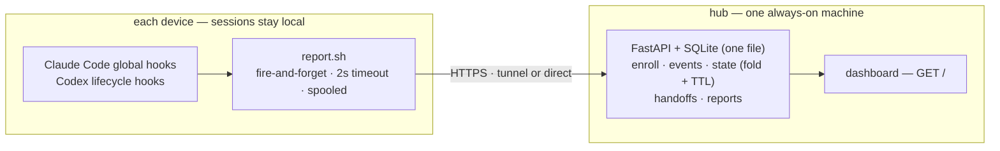

<p align="center">
  <picture>
    <source media="(prefers-color-scheme: dark)" srcset="assets/logo-dark.png">
    
  </picture>
</p>

<p align="center">
  <b>M</b>ulti-<b>A</b>gent &amp; <b>D</b>evice <b>I</b>ntegrated <b>S</b>upervision, <b>O</b>perations &amp; <b>N</b>etworking
</p>

<p align="center">
  <a href="LICENSE"></a>
  
  
</p>

<p align="center">English · <a href="README.ko.md">한국어</a></p>

---

A single-pane control console for AI coding-agent sessions spread across many
machines. If you run **Claude Code** and **Codex** on several Macs (and a
Windows box), MADISON collects each session's state through hooks and shows —
in one dashboard — what is running where, what is waiting on you, and what has
gone quiet. It also moves work between machines: hand a task off
with its context so you can continue it on another machine.

Sessions run **entirely on their own machines**. The hub receives only metadata and
short text snippets — status, an instruction excerpt used for the one-line summary,
model/effort, timestamps. Your code and files never leave the device.

## Why

Once you have four or five machines each running a couple of agents, you lose
track: which session is blocked on a permission prompt, which finished and is
waiting for your next instruction, which crashed and left a session dangling.
MADISON answers "what needs me right now?" across the whole fleet, and lets you
push a piece of work from one machine to another without walking over to it.

## Features

- **Live fleet view** — every session grouped by device, sorted so the things
  waiting on a human (permission prompts, idle-after-completion) float to the top.
- **Reliable liveness** — a session that crashes, sleeps, or drops its network is
  detected by a hub-side TTL, not just by an end-of-session hook that may never fire.
- **Task summaries** — each session's instruction is condensed to one line by a
  small model on the hub (never on the device, never in the hook's critical path).
- **Session traceability** — every session id is one click away and can be resumed
  on its machine with `claude --resume <id>` or `codex resume <id>`.
- **Handoff** — carry a task's context (handoff doc + change diffs, hub-carried,
  no commit or push) to another machine; the target gets a desktop notification
  (macOS) and every new session there is briefed until you `/pickup` — in Claude
  Code or Codex, whichever you prefer.
- **History** — devices, sessions, handoffs, and the raw event log, each
  filterable, behind tabs.
- **Daily/weekly/monthly reports** — the hub condenses each period's work into
  a PM/owner-oriented report markdown (grouped by service, nested bullets) you
  can paste into Notion — the longer the period, the more it synthesizes
  instead of listing. The daily report reads the day as session flows
  (instruction → response pairs; background-task notifications contribute their
  title and a log excerpt as context) with the previous day's topics and its
  still-in-progress details as continuity, so a follow-up question — or an
  overnight batch's notification — lands under the task it belongs to instead
  of surfacing under an internal automation label. On label-only days the
  writer searches its own past reports for what that label meant (the report
  archive doubles as its memory; no separate store), and a validator catches
  label-derived task names and has them renamed. Nothing is truncated — an
  oversized session is condensed first instead of cut. Weekly and monthly
  reports are synthesized from the stored daily reports, not from raw logs. Top-level grouping uses a service
  registry the writer maintains itself (seeded from `.env`, see below), an item
  is filed under the service it is *about* — a hub bug you hit while another
  repo was open lands under the hub, not that repo — and every report passes a
  deterministic validator before it is stored. Regenerated on a cron schedule
  only when something changed, in a separate worker process, or on demand; a
  failed generation never overwrites a good report.
  Plus usage metrics: turns, sessions, active hours, per-service, per-project and
  hourly distributions, and a 52-week streak grid with month labels (scrolls
  horizontally, lands on the most recent week).
- **Subscription usage** — the overview shows Claude Code and Codex rate-limit
  windows (5-hour, weekly, reset credits) with bars and warning colors; the hub
  reads them itself from the providers' own endpoints (see Security model).
- **Usage tab — token accounting & limit history** — collectors attach cumulative
  per-session token counts (input / output / cache read / cache write / thinking,
  per model, parsed from the agents' local transcripts) to turn events; the hub
  folds them into a per-day × device × project × model ledger kept forever, and
  records every rate-limit percentage change. The tab charts limit windows over
  time (step lines), daily token stacks (I/O and cache on separate scales), and
  breakdowns by service / project / model / device / agent / session, filterable
  by period, agent, device, and automation. A one-time script backfills history
  from transcripts still on disk.
- **Configurable hub LLM** — a settings tab picks the provider (Claude Code or
  Codex), model, and reasoning effort separately for task summaries, session
  digests, and report generation, with model lists pulled live from the CLIs
  installed on the hub. Every call is logged (`llm_runs`).
- **Agent + surface aware** — tells `CLAUDE CODE` / `CLAUDE APP` / `CODEX CLI` /
  `CODEX APP` sessions apart, and separates automated headless runs (cron/launchd)
  into their own tab.
- **Local-first & metadata-only** — no dependence on any vendor's remote/cloud
  session infrastructure; the hub is yours.

## Architecture



- **Collector** (per device): global hooks call `report.sh`, which POSTs event
  metadata to the hub with a 2-second timeout and spools to disk on failure. It is
  written to never block or slow a session (always `exit 0`).
- **Hub** (one machine): a single FastAPI process serves both the JSON API and the
  dashboard, backed by one SQLite file. Runs under launchd (stubs included), or any
  supervisor (systemd, etc.) on Linux. Report generation runs in short-lived worker
  processes it launches, so the hub itself can restart at any time.
- **Dashboard**: a single self-contained HTML page that polls `/api/state` every
  five seconds.

Because sessions are local and the collector is one-way and best-effort, the hub
can be down or restarting with **zero effect** on any running session — events
spool and resend when it returns.

## How liveness works

An end-of-session hook can't be trusted (crashes, sleep, killed terminals never
fire it). So MADISON uses two signals: tool-use hooks emit a throttled heartbeat
while a session works, and the hub marks a *working* session **unconfirmed**
after 15 minutes of silence. Sessions that are legitimately idle (waiting on you)
are never demoted by the timer — only genuinely silent *working* sessions are.

## Agent support

| Surface | Coverage |
|---|---|
| Claude Code — terminal CLI, desktop app, IDE | **Full** — the same global hooks fire regardless of front-end |
| Codex — CLI/TUI, desktop | **Full** — global lifecycle hooks collect session, turn, tool, and approval events. A few hosted tools such as WebSearch do not pass through local tool hooks and therefore do not emit per-tool heartbeats |
| Cloud chats / web tasks (claude.ai, ChatGPT, Codex web) | Out of scope — no local footprint to hook |

## Quick start

**Requirements:** Python 3.11+, `jq`, git. macOS/Linux for the hub.

### 1. Run the hub (on your always-on machine)

```bash
git clone https://github.com/hierrr/madison.git
cd madison
python3 -m venv .venv && .venv/bin/pip install -r requirements.txt
cp .env.example .env      # then edit: set ENROLL_SECRET, and hostnames if exposing via a tunnel
.venv/bin/python -m server
```

The hub listens on `127.0.0.1:8787`. On the same machine, open
<http://127.0.0.1:8787>. To reach it from other machines there are two setups:

- **Tunnel** (internet access): put the hub behind a tunnel — e.g. Cloudflare
  Tunnel, which is what the `.env` hostnames and `CF_ACCESS_*` keys are for —
  with a human dashboard host protected by SSO and a machine API host
  authenticated by per-device tokens. See `.env.example`.
- **LAN only** (no tunnel): set `HOST=0.0.0.0` and leave the tunnel keys empty.
  Collectors report straight to `http://<hub-ip>:8787` with their device tokens;
  onboard with `--hub http://<hub-ip>:8787`. The dashboard stays closed to plain
  LAN requests (a 401 is expected) — open it on the hub machine itself, or from
  another machine via SSH port-forwarding (`ssh -L 8787:127.0.0.1:8787 hub`,
  then <http://127.0.0.1:8787>), which the hub sees as loopback and therefore
  admin. Traffic is plain HTTP, so use this only on a network you trust;
  `IP_ALLOWLIST` can additionally pin each device token to an IP.

Either way it is the same single process and port — roles are told apart by the
credentials on each request (device token vs admin), not by the route.

For a persistent service, register a LaunchAgent that runs `scripts/launchd/madison-hub`
(which execs `scripts/_launchd_wrapper.sh` → the venv). The stub's filename becomes the
login-item display name.

### 2. Onboard a device

Zero-touch: the hub serves its own installer. On each machine, run — or just ask
that machine's agent to run it for you:

```bash
curl -fsSL https://madison-api.example.com/install.sh | bash -s -- \
  --name studio --secret <ENROLL_SECRET> --hub https://madison-api.example.com
# Claude Code + Codex collection are both on by default; pass --no-codex to skip Codex
```

This registers the device (a long-lived token, hashed on the server), merges global
hooks for both Claude Code and Codex with any hooks already present, and schedules
the spool flusher. If an older Madison Codex `notify` + 60-second watcher install is
present, the installer restores the user's original `notify` and removes the old
collector path. Open `/hooks` in Codex after installation to review and trust the
new command hooks. Restart any already-open Claude Code and Codex sessions. Rotate
`ENROLL_SECRET` once the whole fleet is enrolled.

### Windows (beta)

Windows collectors ship as PowerShell scripts (`collector/install.ps1`,
`report.ps1`) using the Task Scheduler instead of launchd — **unverified on real
hardware and behind the macOS collector in feature coverage.** The intended flow is
the same zero-touch onboarding: hand the machine's own agent the install command
and let it wire up the hooks. If you run Claude Code inside **WSL**, use the regular
Linux `install.sh` instead — that path is fully supported, not beta.

## Moving work between machines

- **Handoff** (human continues): `/handoff <device>` writes a handoff doc and
  extracts diffs of your uncommitted work (stashes and submodules included), then
  queues both on the hub — no commit or push needed. Work sitting on unpushed
  commits, oversized, or binary changes fall back to a pushed `wip/` branch. The
  target machine shows a desktop notification (macOS, within its 5-minute poll), and any
  new session for that repo — Claude Code or Codex — is briefed at start. Nothing
  is consumed automatically: the handoff stays *pending* until you approve starting
  it via `/pickup`, which applies the diffs (`git apply -3`), marks it *delivered*,
  and, when the work is finished, *done*.

## Service registry (report top-level names)

Reports group work by *service*, not by repository. The set of service names lives in the hub
database (`services`, `project_map`) and is maintained by the report writer itself — there is no
settings UI for it:

- Each daily report is **one structured LLM call** returning `{markdown, assignments, proposals}`.
  Top-level bullets must be names from the registry; when the writer needs a new one it returns a
  proposal with evidence and the hub registers it (guards: repository/directory names, excluded names
  and names a person previously rejected are refused; at most 3 per day).
- **Project → service map** with a *strength*: `strong` for product repositories, `weak` for scratch
  directories whose work is filed under whatever service it is really about. Unmapped projects whose
  sessions consistently land on one service are learned as weak mappings automatically.
- A deterministic validator checks the markdown (allowed top-level names, indentation, no headers, no
  truncation/meta phrases, no excluded names); violations trigger one repair call and anything left is
  shown as *검토 필요* on the report.
- Per-session assignments (service, task, why) and human corrections are stored; corrections made via
  the API (`POST /api/report/relabel`) are fed to later runs as precedents and outrank the writer's cues.

`REPORT_SERVICE_MAP` / `REPORT_KNOWN_SERVICES` / `REPORT_WEAK_PROJECTS` in `.env` seed an empty registry
once. Adjust the registry through the admin API when needed (`/api/services`, `/api/project-map`,
`/api/services/export` for a backup in `.env` format) — for example by asking an agent on the hub machine.
The last 5 generated versions of each report are kept (`report_versions`, restorable with
`POST /api/report/restore`).

## Security model

- **Session transcripts never leave the device.** The hub stores metadata and short
  truncated excerpts only — up to ~600 chars of an instruction (for the summary),
  up to 2,000 chars of the final reply of a turn (head 1,500 + tail 500 when longer —
  the report writer needs the conclusion and the next steps, not the middle), ≤200 chars of a
  permission message, and path-level metadata: the repository name, branch, git remote URL and
  the working directory's path inside the repository. No file contents. The one deliberate exception is
  handoffs: `/handoff` uploads its doc and change diffs to the hub by explicit user
  action (capped at 64KB / 1MB).
- **Three request classes:** device (bearer token), admin (loopback on the hub
  machine, or an SSO-verified dashboard), and enrollment (a shared secret, meant to
  be rotated). Loopback alone is *not* trusted as admin behind a tunnel — CF headers
  are checked so a proxied internet request can't impersonate local.
- **Report generation runs in a separate worker process** (`python -m server.genworker`), so restarting or
  redeploying the hub never loses an in-flight LLM call; the hub only launches workers and shows their state
  (`report_jobs`). One worker at a time.
- **Hub LLM calls are isolated.** `claude -p` runs with `--safe-mode --tools "" --no-session-persistence
  --disable-slash-commands` (codex: `--ephemeral -s read-only`) from a non-repository directory, so the
  user's CLAUDE.md, plugins, hooks, MCP servers and skills never reach the summarizer or the report
  writer, and no session transcripts are written. Every call is logged to `llm_runs` (site, model,
  duration, exit code) and readable via `GET /api/llm-runs`.
- **State-changing endpoints are CSRF-guarded** (`Sec-Fetch-Site`), so a random web
  page open on the hub machine can't drive the hub.
- **Admin (dashboard) access** is granted to loopback connections on the hub
  machine — which is what SSH port-forwarding uses — and to requests carrying a
  verified Cloudflare Access JWT. An authenticating reverse proxy running on the
  hub machine works as a third path: the hub trusts loopback, so the proxy must
  enforce the login itself. The API side always authenticates devices by token,
  independent of transport.

## Uninstall

The installer touches global state, so here is how to undo it on a device (macOS):

```bash
# 1. Stop the launchd jobs
launchctl bootout "gui/$(id -u)/dev.madison.flush" 2>/dev/null
rm -f ~/Library/LaunchAgents/dev.madison.*.plist

# 2. Remove the collector and skills (Claude Code and Codex sides)
rm -rf ~/.claude/madison ~/.claude/skills/handoff ~/.claude/skills/pickup \
       ~/.codex/skills/handoff ~/.codex/skills/pickup

# 3. Restore hook config from the backups the installer made
#    (settings.json.bak-madison-*, hooks.json.bak-madison-*, and config.toml backups
#    when migrating the old collector), or remove MADISON entries from
#    ~/.claude/settings.json and ~/.codex/hooks.json by hand.
```

Then revoke the device from the dashboard's **Devices** tab so its token stops being accepted.

## Configuration (`.env`)

| Key | Default | Meaning |
|---|---|---|
| `HOST` / `PORT` | `127.0.0.1` / `8787` | Hub bind address |
| `DB_PATH` | `data/madison.db` | SQLite file |
| `ENROLL_SECRET` | — | Shared secret for device enrollment; clear/rotate after onboarding |
| `DASHBOARD_HOST` / `API_HOST` | `madison.example.com` / `madison-api.example.com` | Tunnel setups only — human vs machine hostname (the hub itself checks only `API_HOST`, to limit that host to `/api/*` and installer paths) |
| `CF_ACCESS_TEAM_DOMAIN` / `CF_ACCESS_AUD` | — | Tunnel setups only — Cloudflare Access JWT verification for remote dashboard access; leave empty on a LAN-only hub |
| `TTL_STALE_MIN` | `15` | Minutes of silence before a working session is *unconfirmed* |
| `DEVICE_ONLINE_MIN` | `10` | Minutes since last signal to still count a device online |
| `ENDED_HIDE_HOURS` | `24` | Hours before an ended session drops off the live view |
| `EVENT_RETENTION_DAYS` | `0` | Event log retention in days — `0` keeps events forever |
| `TASK_SUMMARY` | `1` | One-line summaries on the hub — needs the selected provider's CLI on the hub machine (else it falls back to a raw excerpt) |
| `TASK_SUMMARY_MODEL` / `TASK_SUMMARY_BIN` | Haiku / `~/.local/bin/claude` | Model and `claude` binary the summary worker calls |
| `CODEX_BIN` | auto-detected | `codex` binary, used when a provider is set to Codex (searches PATH, then the newest nvm install) |
| `REPORT` | `1` | Daily/weekly/monthly work reports |
| `REPORT_MODEL` | `claude-sonnet-5` | Model for report generation |
| `DIGEST_MODEL` | `claude-sonnet-5` | Model that pre-compresses long sessions when a project block exceeds its budget — extraction work, so a cheaper model than the report model is fine |
| `LLM_TIMEOUT_SUMMARY` / `LLM_TIMEOUT_DIGEST` / `LLM_TIMEOUT_REPORT` | `90` / `300` / `900` | Per-site timeout (seconds) for hub LLM calls. A failed or timed-out call never overwrites a stored report — the failure is recorded and shown instead |
| `LLM_CWD` | `~/.madison/llm-cwd` | Working directory for hub LLM calls — outside any repository so the CLI sees no git context |
| `USAGE` / `USAGE_POLL_SEC` | `1` / `180` | Claude / Codex subscription-limit tiles on the overview. The hub reads them itself: Claude via the OAuth token Claude Code keeps in the macOS Keychain (read-only usage endpoint, token never stored), Codex via `codex app-server` RPC. `USAGE=0` hides the tiles |
| `REPORT_DAILY_CRON` / `REPORT_WEEKLY_CRON` / `REPORT_MONTHLY_CRON` | `0 * * * *` / `15 */4 * * *` / `45 */8 * * *` | Local-time cron (5 fields) at which each report is regenerated — only if something changed since the last version. A brand-new day/week/month gets its first report immediately; a hub restart never triggers generation. Generation runs in a separate worker process |
| `REPORT_EXCLUDE_PROJECTS` | *(empty)* | Comma-separated projects to keep out of reports — drops the project's own section and any log line from other projects that mentions its name |
| `REPORT_SERVICE_MAP` | *(empty)* | Comma-separated `project=service` pairs setting each report's top-level grouping (e.g. `web=Acme, api=Acme`). Unmapped projects use their own name; projects with different service names are never merged |
| `REPORT_WEAK_PROJECTS` | *(empty)* | Comma-separated scratch directories (e.g. `dev,new-chat`) whose `REPORT_SERVICE_MAP` entry is only a *weak* default — the report writer moves their work to the service it is actually about |
| `REPORT_KNOWN_SERVICES` | *(empty)* | Semicolon-separated `service=hint` entries for services that have no project of their own — work done inside another service's repo, such as a monorepo. Listed in the report prompt with the hint so the model files those items under the right service (e.g. `Acme Pro=lives in the Acme monorepo, ap- prefixed screens, Billing menu`) |
| `IP_ALLOWLIST` | *(off)* | Optional `name:ip` list restricting device reporting |

LLM choices — provider, model, effort, and CLI paths — can also be changed in the
dashboard's **settings** tab; values saved there live on the hub and override the
`.env` defaults.

## Repository layout

| Path | What |
|---|---|
| `server/` | Hub — FastAPI + SQLite. `app.py` routes · `state.py` ingest/fold/TTL · `llm.py` CLI calls · `summary.py` task summaries · `report.py` report material/prompts/validator · `reporting.py` + `genworker.py` generation workers · `cron.py` schedule · `registry.py` service names · `usage.py` subscription limits |
| `dashboard/` | Single-file HTML dashboard + logo assets |
| `collector/` | Everything device-side — Claude/Codex hooks, `report.sh`, idempotent installer, `/handoff` · `/pickup` skills, Windows beta scripts |
| `scripts/` | launchd stubs (standard pattern) |
| `tests/` | Regression tests for the hub's state fold and the collector |
| `assets/` | Project logo |

## Status

The dashboard UI and AI-generated task summaries are currently Korean-only.

Built and running as a personal fleet console. Local Claude Code and Codex CLI/app
surfaces are collected through global hooks. The Windows collector remains beta
(unverified on real hardware). Contributions welcome.

## License

[MIT](LICENSE) © hierrr
